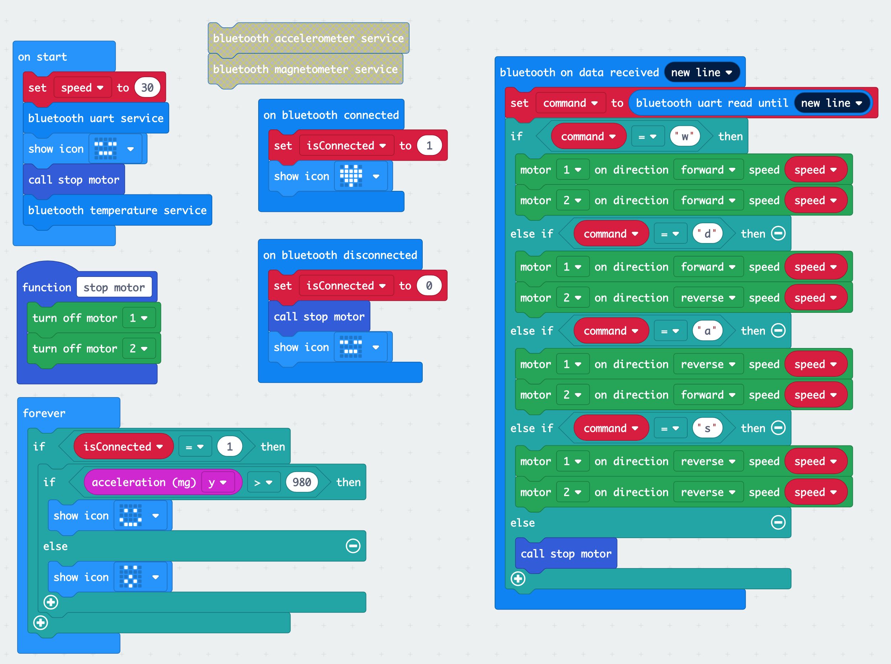

# micro:bit robot with BLE control

## micro:bit code



<div style="position:relative;height:0;padding-bottom:70%;overflow:hidden;"><iframe style="position:absolute;top:0;left:0;width:100%;height:100%;" src="https://makecode.microbit.org/#pub:_E248Ej3awP8J" frameborder="0" sandbox="allow-popups allow-forms allow-scripts allow-same-origin"></iframe></div>


## controller

```
$ go get github.com/atotto/mibot
$ sudo mibot
```

Now, you can control command with:

| code | description |
| --- | --- |
| w | forward |
| a | left |
| d | right |
| s | backward |

